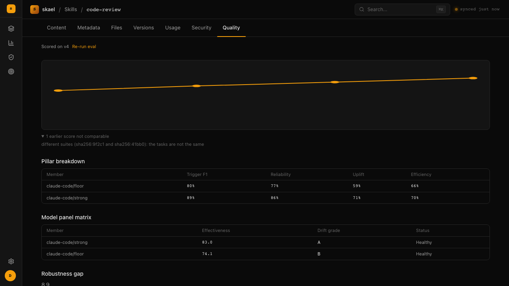

Publishing a skill and scanning it for security problems tells you it's safe to install. It doesn't tell you whether the skill actually helps. Quality scoring is skael's answer to that: a real evaluation, run against a panel of models, that measures a skill's effect on task outcomes.

## What a score is

A panel of models attempts a set of real tasks twice — once with the skill available, once without. The gap between those two runs is the skill's contribution: how much better (or worse) an agent does with it.

A separate model, acting as judge, compares the two transcripts and scores the outcome. Alongside that, a contract checker watches whether the skill did anything it explicitly promised not to — for example, a skill whose spec says "never touch the network" gets flagged if a transcript shows it doing exactly that.

All of that rolls up into a single headline score from 0 to 100.

## What you need to run one

Two things, run separately:

1. **The server.** It queues evaluation jobs but does not run them — no Docker socket and no LLM key live there.
2. **A `skael-worker` process, with a Docker daemon available.** The worker claims jobs from the server, runs the evaluation in a sandboxed container, and posts the score back.

Without a worker running, jobs just sit in the queue — nothing gets scored.

### One credential, two jobs

The judge and the claude-code panel agent both need Anthropic credentials, and in the simplest setup one variable covers both.

- **The judge.** A separate model compares the two transcripts and scores the result. This always runs through the direct Anthropic API — `ANTHROPIC_API_KEY`. The worker checks for this at startup and exits, naming it, if it's missing. There's no fallback to a subscription CLI.
- **The panel agent.** The claude-code adapter is the only one wired up (`codex`, `cursor`, and `opencode` are registered but their parsers aren't implemented yet, so they can't run and have no credentials to configure). It reads credentials as environment variables in the worker's own process and forwards whichever are set into the sandbox:
  - `ANTHROPIC_API_KEY` — the same variable the judge uses. API-billed, no login step. This is what the Claude Code CLI uses by default in non-interactive mode, and it's the recommended setup for a server or VPS.
  - `CLAUDE_CODE_OAUTH_TOKEN` — subscription-billed (Pro/Max) instead of pay-per-call. Generate it once on any machine where you can log in interactively: `claude setup-token`. Set the resulting token as this variable on the worker.

Set one of these and both jobs are covered. Neither is checked for the panel at startup, since the sandbox may already have credentials baked into its image — but if neither is set and no auth directory is available either, the worker logs a warning naming the adapter and the variables that would fix it, instead of the job silently coming back with an **incomplete panel** (see "Reading a score" below).

For local development on a machine that already has an interactive Claude Code login, the adapter also falls back to mounting `~/.claude` and `~/.config/claude` from the host into the sandbox, read-only. That's a convenience, not something to rely on for a server: on macOS the actual credential lives in the Keychain, not in `~/.claude`, so copying that directory to a Linux worker was never going to authenticate anything. Set an environment variable instead.

### Worker environment variables

Required — the worker exits at startup naming whichever is missing:

| Variable | Description |
|---|---|
| `SKAEL_ENDPOINT` | Base URL of the skael server the worker claims jobs from |
| `SKAEL_API_KEY` | API key the worker authenticates with |
| `ANTHROPIC_API_KEY` | Direct Anthropic API key for the judge model — never a subscription CLI on PATH |

Optional, with defaults:

| Variable | Default | Description |
|---|---|---|
| `CLAUDE_CODE_OAUTH_TOKEN` | — | Subscription auth for the claude-code panel agent, as an alternative to `ANTHROPIC_API_KEY`. Generate with `claude setup-token` |
| `WORKER_ID` | `{hostname}-{pid}` | Identifies this worker in job leases |
| `WORKER_LEASE` | `5m` | How long a claimed job's lease lasts before it's considered abandoned |
| `WORKER_POLL` | `15s` | Interval between claim attempts when the queue is empty |
| `WORKER_WORK_ROOT` | OS temp dir | Directory to materialise eval workspaces under |
| `WORKER_CONCURRENCY` | `1` | Must be a positive integer |

The worker also needs a Docker daemon it can reach — every evaluation runs inside a sandboxed container, one job at a time per worker process. Run more worker replicas for more throughput.

### Choosing a judge model and gateway

By default the judge talks to Anthropic's own API. That's optional: point it at OpenRouter or any Anthropic-compatible gateway instead, and pick which models it uses for the strong and fast model classes. Set none of these and nothing changes.

| Variable | Default | Meaning |
|---|---|---|
| `LLM_BASE_URL` | `https://api.anthropic.com` | Gateway base URL. The gateway posts to `{base}/v1/messages`. |
| `LLM_AUTH_STYLE` | `x-api-key` | `x-api-key` (Anthropic's own scheme) or `bearer` (`Authorization: Bearer`, what OpenRouter expects). |
| `LLM_STRONG_MODEL` | `claude-opus-5` | Model for the strong class — this is what the judge uses. |
| `LLM_FAST_MODEL` | `claude-haiku-4-5-20251001` | Model for the fast class. |

`ANTHROPIC_API_KEY` is still the key the judge authenticates with, whichever gateway it points at.

The panel agent (claude-code) has its own path to the same gateway. Its adapter forwards `ANTHROPIC_BASE_URL` and `ANTHROPIC_AUTH_TOKEN`, if set in the worker's environment, into the sandbox — that's what points the panel at OpenRouter instead of Anthropic directly.

A complete OpenRouter setup, covering both the judge and the panel:

```bash
LLM_BASE_URL=https://openrouter.ai/api
LLM_AUTH_STYLE=bearer
LLM_STRONG_MODEL=anthropic/claude-opus-4
ANTHROPIC_API_KEY=<your OpenRouter key>

ANTHROPIC_BASE_URL=https://openrouter.ai/api
ANTHROPIC_AUTH_TOKEN=<your OpenRouter key>
```

OpenRouter model identifiers are namespaced (`anthropic/claude-opus-4`), unlike Anthropic's bare names (`claude-opus-5`). This is a description of what's configurable, not a claim that OpenRouter or any other third-party gateway has been tested end to end here.

Changing the judge model changes what the score means. Two scores judged by different models are not comparable and are not charted on the same trend line — the platform records which model judged each run and splits the trend when it differs, with the reason shown, the same way it already splits on a changed suite or panel (see "Comparing versions over time" below).

The judge is also a calibrated instrument: its agreement with human labels (κ) was measured for a specific judge model. Swap the judge and that calibration no longer describes the judge actually in use.

## A skill needs a suite first

Before a skill can be scored, it needs a registered evaluation suite — the set of tasks the panel will attempt. Generate one with [whetstone](/docs/cli), then register it:

```bash
whetstone suite gen <skill>
whetstone suite push <skill>
```

A skill with no suite gets no score, permanently — there's nothing to run. This is deliberate: scoring against a suite the skill's author never signed off on would measure the wrong thing.

## How long it takes

Roughly 45 to 90 minutes per evaluation. It's running real tasks against real models, twice, plus a judge pass — not a quick lint.

## Reading a score

A score isn't a single flat state. Each of these means something different, and the UI shows them differently on purpose:

- **Unscored.** The skill has never been evaluated. This is not the same as scoring zero — a zero says "measured, and it did badly"; unscored says "nobody has measured it yet." Shown as a dash, not a number.
- **Attested vs. verified.** A verified score came from the queue — the worker ran it and posted the report back through the platform. An attested score is a claim without that chain of custody. Only a verified score can release a version the [publish gate](/docs/concepts#publish-gate) is holding for review.
- **Incomplete panel.** One or more models in the panel failed their health check partway through, so the evaluation couldn't be finished properly. This is flagged separately from a low score — a panel that couldn't finish tells you nothing about whether the skill is good.
- **Stale.** The score is for an older version than the one currently being served. The skill has moved on since it was last measured.

## Comparing versions over time

`GET /api/skills/{name}/quality/series` (and the trend chart on the skill detail page) show how a skill's score has changed across versions.

The one thing to understand here: two scores are only comparable if they came from the same tasks and the same models. Change the suite, or change which models are in the panel, and the number can move even though the skill itself didn't change. Charting that as one continuous line would be misleading — a jump could look like the skill got better or worse when really the yardstick changed.

So the trend line only plots scores that are genuinely comparable to each other. Everything else is listed separately, with the reason it's not part of the trend (different suite, different panel). A trend line that quietly mixed incomparable scores together would be worse than no trend line at all.



In the example above, four versions were scored the same way, so they form one line. A fifth score exists but was run against a different set of tasks, so it sits under the chart with the reason rather than being plotted.

## How this feeds back into publishing

A version held for review by the publish gate clears automatically once it has a **verified** score at or above `QUALITY_FLOOR` (an operator-configured minimum, default `0` — any verified score with a complete panel and no contract violations clears it). Short of that, it takes an owner or admin running `skael review <name> <version> --approve --reason "..."`.

See [Scanning](/docs/concepts#scanning) for the rest of what the gate does, and [`skael review`](/docs/cli#skael-review-skill-name-version) / the [review queue API](/docs/api#review-queue) for acting on held versions.
